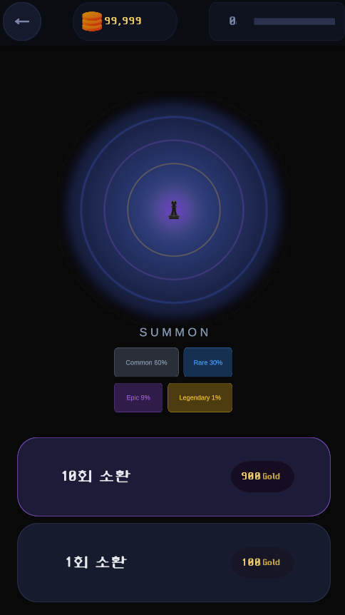
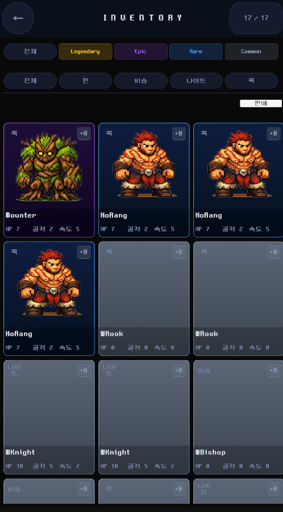
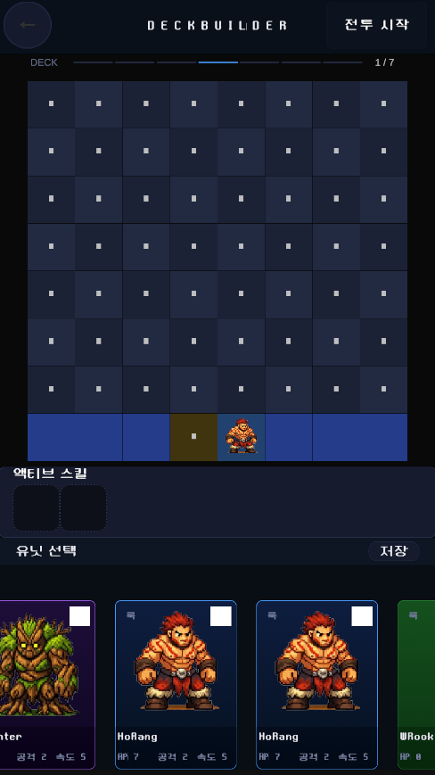
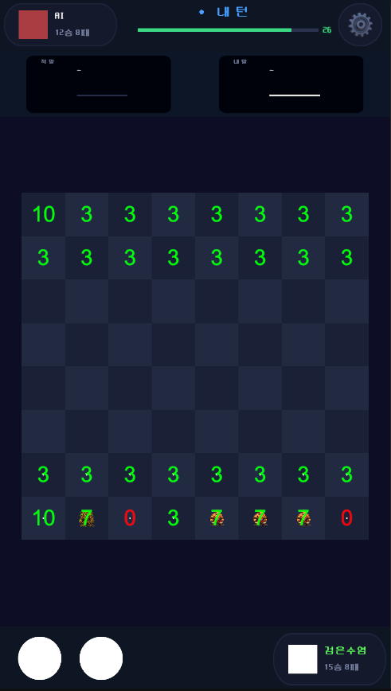

# Royal Piece

**체스 전략 + 가챠 수집 + 덱빌딩 Unity 기반 전략 게임 프로토타입**

Unity를 사용하여 체스 전략과 카드 수집, 덱빌딩 요소를 결합한 프로토타입 프로젝트입니다.  
플레이어는 희귀도별 체스 유닛 카드를 수집하고 7장의 유닛으로 덱을 구성해 AI 전투에 참여합니다.

---

# 👤 About Me

Unity 기반 게임 개발자입니다.  

---

# 🛠 Skills

**Engine:** Unity  
**Language:** C#  
**Tools:** Git, Aseprite

---

# 📖 Overview

Royal Piece는 **체스 전략 + 가챠 수집 + 덱빌딩**을 결합한 Unity 게임 프로토타입입니다.  
- 카드 수집과 덱 구성 전략이 전투에 직접적으로 영향을 줌  
- 유닛마다 Active Skill 존재 여부가 달라 덱 빌딩 전략과 연결  
- 시스템 중심으로 UI와 게임 구조를 프로토타입 단계까지 완성

---

# 🎮 Core Features

## 🎰 Gacha System
- 단일 뽑기 / 10연 뽑기 지원
- 희귀도 기반 드롭 (Common, Rare, Epic, Legendary)
- 인벤토리에 자동 저장

## 🃏 Deck Builder
- 슬롯 기반 7유닛 덱 구성
- 희귀도 컬러 피드백
- 덱 저장/불러오기 가능

## 📦 Inventory System
- 보유 유닛 카드 목록 열람
- 필터링 UI
- PlayerPrefs 기반 로컬 저장

---

# ⚡ Active Skill System

- 덱에 편성된 유닛 중 Active Skill 보유 유닛 선택 가능
- 전투 시작 전 2개의 Active Skill 선택 후 사용
- 덱 구성에 따라 선택 가능한 스킬 풀이 달라짐

---

# 🎨 UI Design

- 다크 컬러 팔레트 기반
- 희귀도별 컬러 코드로 카드 등급 시각화
- UI 구조 일관성 유지

---

# 🧱 Project Architecture

 - Chess.Core - 게임 데이터, 유닛 정의, 희귀도 시스템
 - Chess.Simulation - 전투 로직, 게임 규칙
 - Chess.Presentation - UI, HUD, 카드 렌더링

---

# 🗺 Scene Structure

- **MainMenu:** 시작 화면 / 씬 허브  
- **GachaScene:** 단일/10연 뽑기, 획득 확인  
- **InventoryScene:** 유닛 목록 열람, 상세 정보, 강화  
- **DeckBuilderScene:** 7유닛 덱 구성, 저장/불러오기  
- **InGameScene:** AI 대전 프로토타입, Attack Line 시각화

---

# 🔧 Development Status

**현재 구현 완료:**
- 가챠 시스템
- 유닛 인벤토리
- 덱 빌딩
- Active Skill 선택
- AI 기반 전투 프로토타입
- UI 구조 대부분

**미구현 / 개선 예정:**
- 유닛 공격 애니메이션
- 스킬 사용 시스템
- 스킬 이펙트 및 전투 연출

---

# 📷 Screenshots

| Gacha | Inventory | Deck Builder | Combat |
|-------|-----------|--------------|--------|
|  |  |  |  |

---

# 🎥 Gameplay Video

[Gameplay Video](https://youtube.com/placeholder)

---

# 🚀 Future Improvements

- 전투 시스템 개선 및 스킬 연출 추가  
- UI/UX 최적화  
- 추가 유닛 및 스킬 구현  
- 밸런스 조정 및 기능 확장
